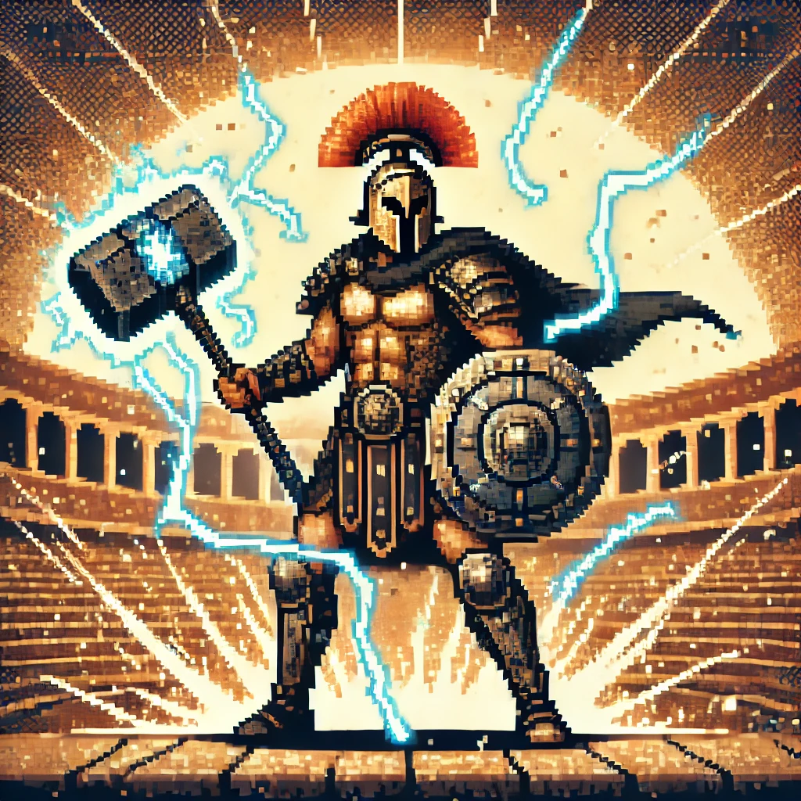

# Arena DAO Gladiators (ADG)

Arena DAO Gladiators (ADG) is Arena DAO’s own esports team and NFT-based subDAO, designed to serve as the DAO’s open-inclusion mechanism. Arena DAO Gladiators combines the excitement of competitive gaming with decentralized governance, giving members a unique opportunity to shape both the team’s direction and the broader Arena DAO ecosystem.

<figure><figcaption></figcaption></figure>

### Key Features

* **NFT-Based Membership and Governance**: Each Arena DAO Gladiator NFT represents membership in ADG, providing holders with voting rights within the subDAO and the power to influence ADG’s decisions and operations.
* **Semi-Autonomous SubDAO Structure**: Arena DAO Gladiators operates with a level of independence within Arena DAO, managing its own initiatives and strategic goals while still aligning with the DAO’s overarching mission.
* **Collective Influence in Arena DAO**: ADG has a dedicated voice within Arena DAO’s governance, giving NFT holders a meaningful way to contribute to major decisions affecting the entire community.
* **Exclusive Gladiator Designs**: Each NFT in the collection features a unique AI-generated gladiator, with diverse designs and attributes that enhance both collectible value and member identity.

### Governance in Arena DAO Gladiators

The Arena DAO Gladiators subDAO empowers NFT holders with significant influence, allowing them to:

* **Propose and Vote on ADG-Specific Initiatives**: Shape the ADG team’s operations, competitive involvement, and future growth strategies.
* **Allocate Resources for ADG Activities**: Direct funding, events, and other resources for the benefit of the Gladiator community.
* **Represent ADG Interests in Arena DAO**: Voice ADG’s unique perspectives and needs in the main Arena DAO governance discussions.

### Voting Power and Influence

* **Within ADG**: Voting power in the subDAO is impacted by factors such as NFT rarity and number of NFTs held.
* **Within Arena DAO**: The Gladiators subDAO has collective voting rights in Arena DAO, amplifying the influence of NFT holders across the entire ecosystem.

### Additional Benefits of Arena DAO Gladiator NFT Ownership

Owning an Arena DAO Gladiator NFT unlocks exclusive perks, including:

* **Access to Gladiator-Only Competitions**: Participate in esports events and competitions exclusively for ADG members.
* **Special Roles in Arena DAO**: Engage in specialized roles or responsibilities within the DAO, enhancing your involvement and influence.
* **Future Rewards**: Potential airdrops, rewards, or other benefits as part of ongoing community engagement and ADG growth.

### How to Acquire an Arena DAO Gladiator NFT

Arena DAO Gladiators will launch on the **Superbolt platform** with an exclusive total supply of **300 NFTs**. Details about the minting process and distribution method will be shared in upcoming announcements. Follow our official channels to stay updated on the Superbolt launch and secure your opportunity to join the ADG community.



