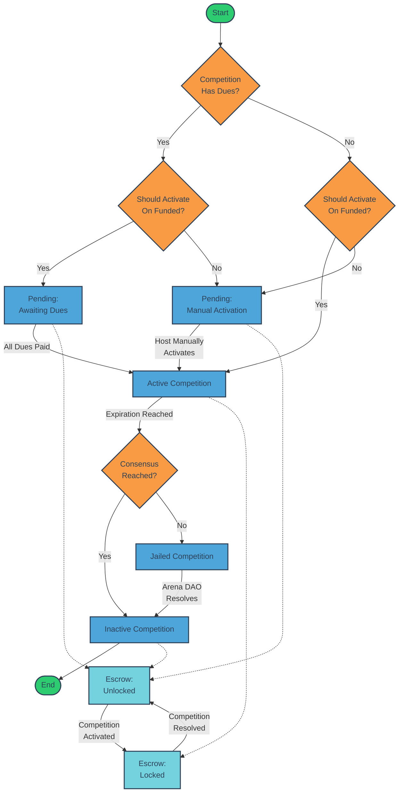

# Competition Modules

Arena DAO offers a diverse range of competition modules, each designed to cater to different types of contests and user preferences. Our modular approach allows for flexible, scalable, and customizable competition experiences within the decentralized ecosystem.

### Available Modules


[wagers.md](wagers.md)



[leagues.md](leagues.md)



[tournaments.md](tournaments.md)

